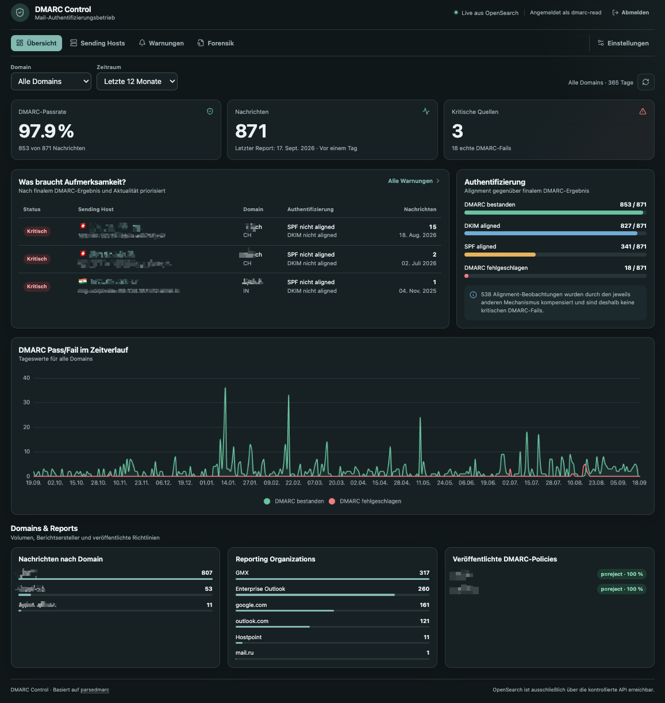
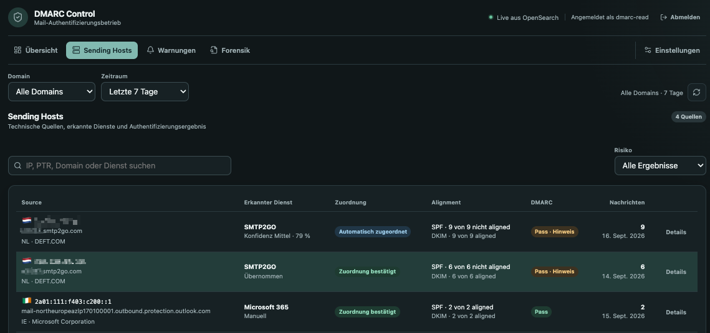
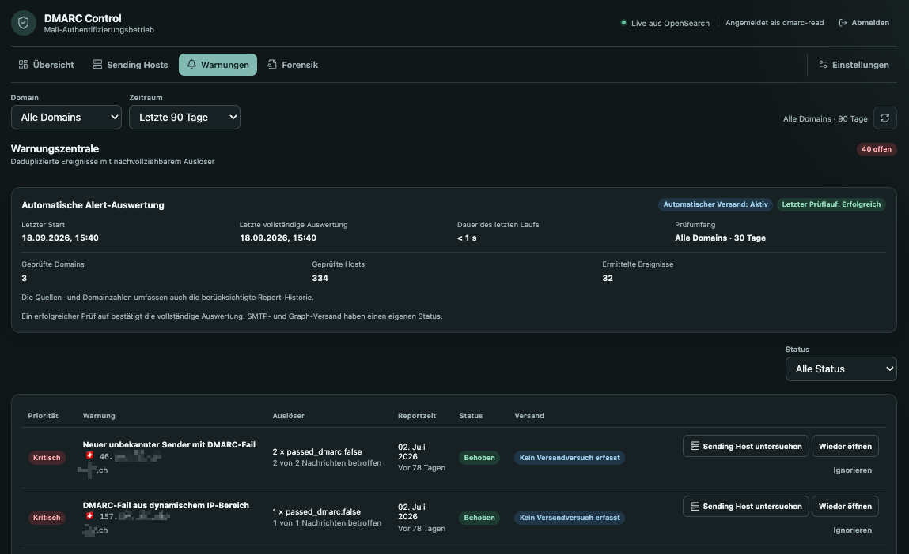
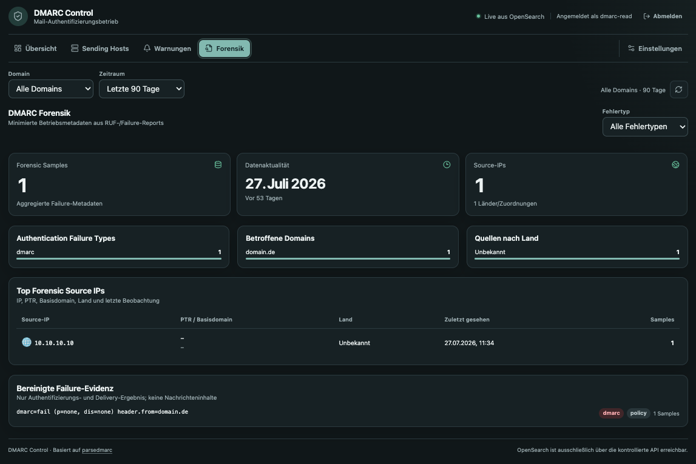
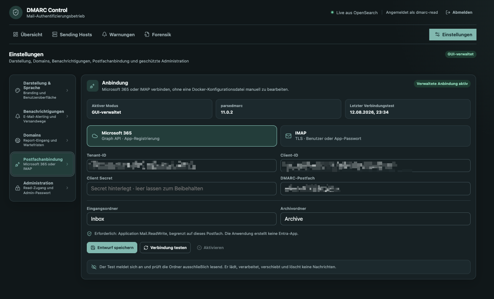

<p align="center">
  
</p>

<h1 align="center">DMARC Control</h1>

<p align="center">
  <strong>Understand DMARC reports, control sending sources, and act on risk.</strong>
</p>

<p align="center">
  Self-hosted DMARC monitoring with a web-first setup and operations workflow.
</p>

<p align="center">
  
  
  
</p>

<p align="center">
  <a href="#release-installation-web-ui">Installation</a> ·
  <a href="#post-installation">Post-installation</a> ·
  <a href="#optional-grafana">Grafana</a> ·
  <a href="#operations">Operations</a>
</p>

DMARC Control is a self-hosted platform for collecting, analysing, and acting
on DMARC reports. It combines
[parsedmarc](https://github.com/domainaware/parsedmarc), OpenSearch, and a
dedicated React/FastAPI application in a Docker Compose deployment.

The normal data flow is:

`DMARC mailbox → parsedmarc → OpenSearch → DMARC Control web UI`

The web UI is the standard interface. Grafana is available as an optional
analytics view for existing or specialised deployments.

## Product overview

DMARC Control provides:

- a risk-focused overview of message volume, DMARC pass rates, failures,
  policies, report freshness, and trends;
- a sending-host inventory with IP, PTR, ASN, country, identities, service
  detection, confidence, and manual classification;
- domain monitoring and explainable Microsoft 365 sender assessment based on
  MX, SPF, DKIM, and DMARC history;
- persistent alert triage with open, acknowledged, resolved, and ignored
  states;
- managed report ingestion through Microsoft Graph or IMAP;
- optional alert email delivery through SMTP or Microsoft Graph;
- privacy-conscious defaults: forensic/RUF storage is disabled unless it is
  explicitly enabled.

Microsoft 365 assessment adds context; it is not an allowlist. A confirmed or
automatically expected provider can calm a fully DMARC-passing new-source
event, but DMARC failures remain critical.

## Screenshots

All screenshots use anonymised report data and show the standard dark user
interface.

### Overview

The overview brings report volume, DMARC pass rate, critical sources, the
current authentication alignment, and trends together in one place.



### Sending Hosts

Technical sending sources can be reviewed, classified, and inspected with
their authentication result and message volume.



### Alerts

The alert centre groups detectable DMARC events and records their triage state
and delivery status.



### Forensics

When forensic/RUF processing is explicitly enabled, the forensic view exposes
minimised failure metadata without displaying message content.



### Mailbox connection

The web UI manages a Microsoft 365 or IMAP report mailbox, including a
connection test before activation.



## Release installation: web UI

Use the published, digest-pinned images for a normal Docker Compose deployment.
It requires only the Compose file and `.env`, and does not build or clone the
repository. Grafana is not part of this deployment profile.

### Requirements

- A Linux host with Docker Engine and Docker Compose v2
- Permission to create the bind-mount directories with the required UIDs
- TCP port `3030` available for the web UI
- `vm.max_map_count=262144` for OpenSearch

Set the OpenSearch kernel requirement:

```bash
sudo sysctl -w vm.max_map_count=262144
echo "vm.max_map_count=262144" | sudo tee /etc/sysctl.d/99-opensearch.conf
```

### Add the Compose file and environment

Create a deployment directory of your choice. Save the contents of
[`docker-compose.release.yml`](docker-compose.release.yml) there as
`docker-compose.yml`, and save [`.env.release.example`](.env.release.example)
there as `.env`. Set the required absolute directory placeholder and replace
`OPENSEARCH_ADMIN_PASSWORD` with a strong bootstrap password:

```dotenv
DMARC_DEPLOYMENT_ROOT=__REPLACE_WITH_YOUR_ABSOLUTE_DMARCREAD_DIRECTORY__
OPENSEARCH_ADMIN_PASSWORD=REPLACE_WITH_A_LONG_RANDOM_PASSWORD
```

Do not commit `.env`; it is installation-specific and may contain secrets.
The deployment directory is the single source of truth. It contains `.env`,
`docker-compose.yml`, `data/`, `backups/`, `config/` and `dmarc-reports/`.
The backup service reads the deployment configuration from this directory and
includes it in the encrypted control backup.

### Prepare bind mounts before the first deploy

Docker creates a missing bind-mount source directory as `root:root`. That
prevents OpenSearch (UID `1000`) and the dashboard, parser-control and backup
services (UID `10001`) from writing their persistent data. Create the paths
and ownership before calling Compose. Set the shell variable to the same
absolute path used in `.env`:

```bash
export DMARC_DEPLOYMENT_ROOT=__REPLACE_WITH_YOUR_ABSOLUTE_DMARCREAD_DIRECTORY__

sudo install -d -o 1000 -g 1000 -m 0750 "$DMARC_DEPLOYMENT_ROOT/data/opensearch"
sudo install -d -o 10001 -g 10001 -m 0770 "$DMARC_DEPLOYMENT_ROOT/data/dashboard"
sudo install -d -o 10001 -g 10001 -m 0770 "$DMARC_DEPLOYMENT_ROOT/data/parser-control"
sudo install -d -o 10001 -g 10001 -m 2770 "$DMARC_DEPLOYMENT_ROOT/backups"
sudo install -d -o 10001 -g 10001 -m 2770 "$DMARC_DEPLOYMENT_ROOT/backups/opensearch"
sudo install -d -o 10001 -g 10001 -m 2770 "$DMARC_DEPLOYMENT_ROOT/backups/opensearch/repository"
sudo install -d -o 10001 -g 10001 -m 2770 "$DMARC_DEPLOYMENT_ROOT/backups/manifests"
sudo install -d -o 10001 -g 10001 -m 2770 "$DMARC_DEPLOYMENT_ROOT/backups/control"
sudo install -d -o root -g 10001 -m 0750 "$DMARC_DEPLOYMENT_ROOT/config"
sudo install -d -o root -g 10001 -m 0750 "$DMARC_DEPLOYMENT_ROOT/dmarc-reports"

sudo chown -R 1000:1000 "$DMARC_DEPLOYMENT_ROOT/data/opensearch"
sudo chown -R 10001:10001 "$DMARC_DEPLOYMENT_ROOT/data/dashboard" "$DMARC_DEPLOYMENT_ROOT/data/parser-control" "$DMARC_DEPLOYMENT_ROOT/backups"
sudo chmod -R u+rwX,g+rwX "$DMARC_DEPLOYMENT_ROOT/backups"

sudo chown root:10001 "$DMARC_DEPLOYMENT_ROOT/.env" "$DMARC_DEPLOYMENT_ROOT/docker-compose.yml"
sudo chmod 0640 "$DMARC_DEPLOYMENT_ROOT/.env" "$DMARC_DEPLOYMENT_ROOT/docker-compose.yml"
```

`install -d` is intentional: unlike `mkdir -p`, it creates each directory with
the required owner, group and mode. The backup tree uses mode `2770`; the
leading `2` sets the setgid bit, so new snapshot files retain group `10001`.
OpenSearch receives that group through the Compose `group_add` setting and can
therefore write its snapshot repository. The subsequent recursive `chown` and
`chmod` commands are harmless on a new host and repair an existing tree that
was previously created with the wrong ownership.

The `config/` directory may remain empty for a new UI-managed mailbox setup.

### Start the stack

`dmarc-net` is defined in the release Compose file and Docker creates it on
the first deployment. No manual network creation is required.

Change into the deployment directory and start the stack:

```bash
cd "$DMARC_DEPLOYMENT_ROOT"
docker compose pull
docker compose up -d
docker compose ps
```

Open `http://HOSTNAME_OR_IP:3030`.

### Complete first-time setup

The first browser visit opens the setup screen. Create:

- a read username and password for normal dashboard access;
- a separate administrator password for protected settings.

Both passwords must contain at least 12 characters. The dashboard is available
after setup, but report ingestion remains idle until a mailbox connection has
been tested and activated. On a clean installation, `docker compose ps` may
show `parsedmarc` as unhealthy until that activation; this is expected.

## Build from source

The repository's `docker-compose.yml` remains available for local development
and source-based deployments. It uses local `build:` definitions instead of
the published images. Clone the repository, create `.env` from `.env.example`,
prepare its relative `data/`, `config/`, `dmarc-reports/` and `backups/` paths
with the same UID ownership rules above, then run:

```bash
docker compose up -d --build --remove-orphans
```

## Post-installation

### Connect a report mailbox

Open **Settings → Mailbox connection**, authenticate as administrator, and
choose Microsoft 365 or IMAP.

The workflow is deliberately explicit:

1. Save the connection as a draft.
2. Run **Test connection**.
3. Review the result.
4. Activate the successfully tested revision.

The connection test is read-only. It verifies authentication and access to the
configured folders without reading, moving, or deleting report messages.
Activation starts report processing with the selected revision.

For Microsoft 365, use a dedicated report mailbox and create the report and
archive folders before testing the connection. The defaults are
`Inbox/DMARC` and `Inbox/DMARC/Processed`. The current UI supports client-secret
authentication. Assign `Application Mail.ReadWrite` through Exchange Online
Application RBAC scoped to the dedicated mailbox; do not add a tenant-wide
grant for the same permission. See
[Microsoft 365 mailbox integration](docs/M365.md) for the complete setup and
verification procedure.

For IMAP, provide the TLS-enabled server, credentials, report folder, and
archive folder in the same screen.

### Configure email notifications

Notifications are disabled by default. Open **Settings → Notifications** and
configure one of these transports:

- SMTP with STARTTLS, implicit TLS, or an explicitly trusted internal relay;
- Microsoft Graph with `Mail.Send`, ideally restricted to the configured
  sender mailbox.

Set the sender, recipients, language, public dashboard URL, and event types.
Save the settings, send a test message, and only then enable automatic
notifications. A test message does not enable alerting by itself.

### Review monitored domains

Open **Settings → Domains** to add expected domains, retire unused domains, and
review Microsoft 365 evidence. Administrators can confirm or reject the
automatic provider assessment without weakening DMARC-failure handling.

### Verify report processing

After mailbox activation, wait for the first DMARC aggregate report and check
the overview. Parser logs are available with:

```bash
docker compose logs -f parsedmarc
```

## Container releases

Version tags publish the dashboard and parser/supervisor as multi-architecture
images to GitHub Container Registry. The parser image retains the DMARC Control
supervisor; it is not interchangeable with the bare upstream parsedmarc image.
See [Container releases](docs/CONTAINER-RELEASES.md) for the release and
digest-pinning procedure, including the mandatory bind-mount preparation for
standalone Docker Compose deployments.

## Optional Grafana

Grafana can be used as the primary analytics view, but it does not replace the
DMARC Control service. Initial setup, mailbox management, domain settings,
alert triage, and notifications remain in the web UI.

Enable the profile in `.env`:

```dotenv
COMPOSE_PROFILES=grafana
GRAFANA_ADMIN_PASSWORD=REPLACE_WITH_A_STRONG_PASSWORD
```

Prepare its persistent directory and update the stack:

```bash
mkdir -p data/grafana
sudo chown 472:472 data/grafana
docker compose up -d --build --remove-orphans
```

Open `http://HOSTNAME_OR_IP:3020` and sign in as `admin` with the password from
`.env`. The repository provisions overview, analysis, and forensic dashboards.
The forensic dashboard remains empty while forensic/RUF storage is disabled.

## Security and data

- OpenSearch has no host-published port and is used over the internal Compose
  network. Do not publish its port directly.
- Port `3030` serves HTTP by default. Do not expose it directly to the public
  internet; use a firewall and an HTTPS reverse proxy for remote access.
- Mailbox and notification secrets are encrypted before they are stored in
  `data/dashboard/dashboard.db`. The matching key is stored in
  `data/dashboard/connection.key`.
- Forensic/RUF reports can contain personal or sensitive message metadata and
  are disabled by default. Enable them only with an approved retention and
  access policy.
- A complete recovery requires consistent backups of the persistent data and
  installation configuration. Do not copy the live OpenSearch directory as a
  backup. Follow [Backup and restore](docs/BACKUP-RESTORE.md) before operating
  the stack in production.

## Operations

### Update

Installations created with older Docker volumes may require a one-time data
migration. Read [Migration to portable data](docs/MIGRATION-TO-PORTABLE-DATA.md)
first. If the installation still uses the old volumes, stop and migrate it
before running the Compose update below.

For a release-image installation, update the image references to the intended
digest-pinned release, then run:

```bash
docker compose -f docker-compose.release.yml pull
docker compose -f docker-compose.release.yml up -d
```

For a source-based installation, update the repository and rebuild:

```bash
git pull --ff-only
docker compose up -d --build --remove-orphans
```

### Basic checks

```bash
docker compose ps
curl -fsS http://localhost:3030/api/health
docker compose logs --tail=100 dashboard parsedmarc opensearch
```

## Further documentation

| Document | Purpose |
|---|---|
| [Microsoft 365 mailbox integration](docs/M365.md) | Dedicated mailbox, Graph permissions, and Exchange Application RBAC |
| [Dashboard and operations](docs/CUSTOM-DASHBOARD.md) | Architecture, APIs, alerting behaviour, and deployment notes |
| [Backup and restore](docs/BACKUP-RESTORE.md) | Data ownership, consistency requirements, and recovery order |
| [Migration to portable data](docs/MIGRATION-TO-PORTABLE-DATA.md) | Moving older Docker volumes into the current bind-mount layout |

The Compose and Docker build files are the source of truth for component
versions, container settings, published ports, and optional profiles.
